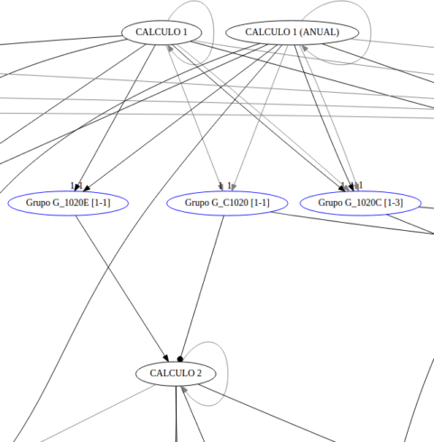

# udelar

Scripts para scrapear la página de bedelías, transformar la información de previas a json y generar graficas de previas con graphviz.

Las gráficas generadas son demasiado grandes y complicadas. Para que resultaran útiles deberían filtrarse todas las previas que no se dictan más. El sistema de grupos de la facultad complica todo:

- Las materias pueden tener como previas, el examen o curso de una materia, o un grupo.
- Un grupo a su vez se satisface sumando puntos, que se obtienen de las previas del grupo (que a su vez son materias o otras actividades).
- Cada grupo tiene un rango de puntos con los que se satisface. En vez de decir que tenés que tener "Cálculo 1" o "Cálculo 1 (Anual)" para hacer Cálculo 2, dice que para hacer C2 tenés que hacer el grupo x que se satisface con 1 punto. C1 te da un punto y C1 anual te da 1 punto.



_Referencias:_

- Flecha negra: Examen (o grupo) requerido.
- Flecha gris: Curso requerido.
- Punta triangular: Es previa del examen.
- Punta circular: Es previa del curso.

En [previas](previas/) están los svg que generé para ingeniería eléctrica. Se los puede bajar y ver con `google-chrome archivo.svg`.


## Requerimientos

- bash
- wget
- [nodejs and npm]()
- [cheerio]()
- [html-xml-utils]() - cli para manipular html
- [jq]() - cli para manipular json
- [graphviz]() - graficas

## 1. Scrape

```bash
apt install html-xml-utils
./scrape.sh
```

Demora como 2 minutos. Dejarlo terminar. Tira varias warnings por stderr que se pueden ignorar. Usa `wget-download.sh` para bajar las páginas del dominio recursivamente.

Con `html-xml-utils` y `grep` extraigo los links necesarios de las páginas ya bajadas y guardo las url relevantes en los archivos `{facultades,carreras,planes}.txt`. Con esas urls sigo bajando con wget. Al terminar el script quedan cuatro carpetas correspondientes a los subdominios de bedelias.edu.uy.

```
$ ls -d *.uy
bedelias.edu.uy  www1.bedelias.edu.uy  www2.bedelias.edu.uy  www3.bedelias.edu.uy
```


## 2. json

```bash
npm i cheerio
# apt install libc-bin # se precisa iconv por un tema de encodings, pero por lo general ya esta instalado.
./extract-previas.sh
```

Demora como 5 minutos. Usa `extract-previas.js` y `extract-grupos.js` para extraer información de los archivos bajados y ponerla en archivos json en [previas](previas/), por carrera.

## 3. graphviz


```bash
cd previas
apt install graphviz jq
./graph-carr.sh carrfile grpfile [ranksfile] [asigid]
```

`graph-carr.sh` genera los archivos .dot que graphviz consume a partir de los archivos .json del paso anterior. Toma como argumentos:

- `carrfile` - el archivo json de la carrera.
- `grpfile` - el archivo json con los grupos de la carrera.
- `ranksfile` - opcionalmente un archivo .dot que se concatena con el resultado. Usado para forzar que ciertas materias esten al mismo nivel en el eje vertical.
- `asigid` - si se pasa este argumento el script usa `ccomps` (parte de graphviz) para dejar solo los nodes conectados a la asignatura con ese id. Esto simplifica un poco la grafica.

Los archivos de grupos (`previas/${carrera}-grupos.json`) generados por `2.` tienen los grupos de todas las carreras bajo una facultad. El script `ingenieria-grupos-22-8.js` filtra estos grupos dejando solo los que están involucrados en la carrera 22-8, y guardando el resultado en `ingenieria-grupos-22-8.json`. No quise generar los svg para todas las carreras porque demoraria un montón y no tiene mucho sentido visto que el resultado no es gran cosa. Con editar los `require`s este script haría lo mismo para otras carreras. Y sino se puede usar el `grpfile` genérico de la facultad.

Para ingenieria-22-8 hago:

```bash
./ingenieria-grupos-22-8.js
./graph-carr.sh ingenieria-22-8.json ingenieria-grupos-22-8.json ingenieria-ranksame-22-8.dot 1024
```

Que produce `ingenieria-22-8.svg`.


## Lo que faltaría...

Para mejorar las gráficas habría que resolver el tema de los grupos. Una posibilidad es cargar el svg generado en una página web donde el usuario, con ayuda del programa, va filtrando la gráfica con las asignaturas que ya hizo, o borrando las que no va a hacer, y los grupos satisfechos se sustituyen por el vínculo directo.
